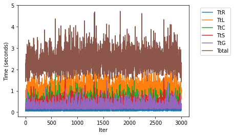
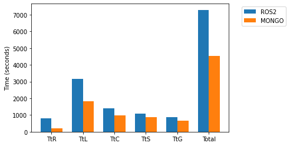

# ros2 Experiments

## Results

### Local

  
   
  
   

### Local Containers

  
   
  
   

### Cloud Containers

  
   
  
   

### Mixed

  <!--img src="Results/ContenedoresMixed/ros2.png" width="400" /-->
  
   
  
   

### VPN Mixed

  
   
  
   

