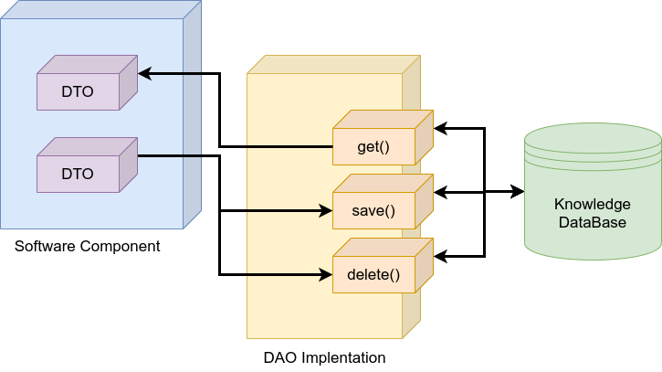

# KANT (Knowledge mAnagemeNT)

<p align="center">
  
</p>

This is a ROS 2 tool to manage PDDL-based knowledge from Python and C++ code. It is based on several software design patterns (DTO, DAO, Factory).

## Table of Contents

1. [Features](#features)
2. [Installation](#installation)
   - [Mongoengine](#mongoengine)
   - [Mongocxx](#mongocxx)
   - [MongoDB](#mongodb)
   - [Mongo Compass (Optional)](#mongo-compass-optional)
   - [KANT](#kant)
3. [Knowledge Base](#knowledge-base)
4. [Demos](#demos)
   - [Python](#python)
   - [Cpp](#cpp)
5. [Experiments](#experiments)
6. [Citations](#citations)

## Features



There are two DAO families implemented:

- `MONGO`: this is a DAO family that uses MongoDB to storage the PDDL knowledge. Besides, the Mongoengine Python library is used to access MongoDB.
- `ROS2`: this is a DAO family that uses a ROS 2 node to storage the PDDL knowledge. ROS 2 services are used.

PDDL elements (DTOs) that can be used are:

- types
- objects
- predicates
- propositions
- goals
- actions (and durative)

## Installation

### Mongoengine

```shell
$ sudo pip3 install mongoengine dnspython
```

### Mongocxx

```shell
$ sudo apt install libmongoc-dev libmongoc-1.0-0 -y  # Ubuntu 20, mongoc 1.16.1

$ curl -OL https://github.com/mongodb/mongo-cxx-driver/archive/refs/tags/r3.4.2.tar.gz
$ tar -xzf r3.4.2.tar.gz

$ cd mongo-cxx-driver-r3.4.2/build
$ cmake .. -DCMAKE_BUILD_TYPE=Release -DCMAKE_INSTALL_PREFIX=/usr/local -DBSONCXX_POLY_USE_BOOST=1
$ cmake --build .
$ sudo cmake --build . --target install

$ export LD_LIBRARY_PATH=/usr/local/lib:$LD_LIBRARY_PATH
$ echo 'export LD_LIBRARY_PATH=/usr/local/lib:$LD_LIBRARY_PATH' >> ~/.bashrc

$ rm r3.4.2.tar.gz
$ rm -rf mongo-cxx-driver-r3.4.2
```

### MongoDB

```shell
$ wget -qO - https://www.mongodb.org/static/pgp/server-4.4.asc | sudo apt-key add -
$ sudo apt-get install gnupg
$ wget -qO - https://www.mongodb.org/static/pgp/server-4.4.asc | sudo apt-key add -
$ echo "deb [ arch=amd64,arm64 ] https://repo.mongodb.org/apt/ubuntu focal/mongodb-org/4.4 multiverse" | sudo tee /etc/apt/$ sources.list.d/mongodb-org-4.4.list
$ sudo apt-get update
$ sudo apt-get install -y mongodb-org
$ sudo systemctl start mongod
```

### Mongo Compass (Optional)

https://docs.mongodb.com/compass/master/install/

### KANT

```shell
$ cd ~/ros2_ws/src
$ git clone git@github.com:uleroboticsgroup/simple_node.git
$ git clone git@github.com:uleroboticsgroup/kant.git
$ cd ~/ros2_ws
$ colcon build
```

## Knowledge Base

PDDL knowledge can be stored in a ROS 2 node or in a MongoDB database:

- MongoDB

```shell
$ sudo apt service mongod start
```

- ROS 2

```shell
$ ros2 run kant_knowledge_base knowledge_base_node.py
```

## Demos

A Python and a C++ demo are included.

### Python

```python
#!/usr/bin/env python3

""" DAO Example Node """

import rclpy

from kant_dao.dao_factory import (
    DaoFactoryMethod,
    DaoFamilies
)

from kant_dto import (
    PddlTypeDto,
    PddlObjectDto,
    PddlPredicateDto,
    PddlPropositionDto,
    PddlConditionEffectDto,
    PddlActionDto
)

from simple_node import Node


class ExampleNode(Node):
    """ DAO Example Node Class """

    def __init__(self):

        super().__init__("example_node")

        dao_factory_method = DaoFactoryMethod()

        uri = "mongodb://localhost:27017/kant"
        dao_family = DaoFamilies.MONGO

        dao_factory = dao_factory_method.create_dao_factory(dao_family,
                                                            uri=uri,
                                                            node=self)

        # creating DAOs
        pddl_type_dao = dao_factory.create_pddl_type_dao()
        pddl_object_dao = dao_factory.create_pddl_object_dao()
        pddl_predicate_dao = dao_factory.create_pddl_predicate_dao()
        pddl_proposition_dao = dao_factory.create_pddl_proposition_dao()
        pddl_action_dao = dao_factory.create_pddl_action_dao()

        # types
        robot_type = PddlTypeDto("robot")
        wp_type = PddlTypeDto("wp")

        # predicates
        robot_at = PddlPredicateDto(
            "robot_at", [robot_type, wp_type])

        # objects
        rb1 = PddlObjectDto(robot_type, "rb1")
        wp1 = PddlObjectDto(wp_type, "wp1")
        wp2 = PddlObjectDto(wp_type, "wp2")

        # propositions
        pddl_proposition_dto = PddlPropositionDto(robot_at, [rb1, wp1])
        pddl_goal_dto = PddlPropositionDto(robot_at, [rb1, wp2], is_goal=True)

        # actions
        r = PddlObjectDto(robot_type, "r")
        s = PddlObjectDto(wp_type, "s")
        d = PddlObjectDto(wp_type, "d")

        condition_1 = PddlConditionEffectDto(robot_at,
                                             [r, s],
                                             time=PddlConditionEffectDto.AT_START)

        effect_1 = PddlConditionEffectDto(robot_at,
                                          [r, s],
                                          time=PddlConditionEffectDto.AT_START,
                                          is_negative=True)

        effect_2 = PddlConditionEffectDto(robot_at,
                                          [r, d],
                                          time=PddlConditionEffectDto.AT_END)

        pddl_action_dto = PddlActionDto(
            "navigation", [r, s, d], [condition_1], [effect_1, effect_2])

        # saving all
        pddl_object_dao.save(rb1)
        pddl_object_dao.save(wp1)
        pddl_object_dao.save(wp2)

        pddl_proposition_dao.save(pddl_proposition_dto)
        pddl_proposition_dao.save(pddl_goal_dto)

        pddl_action_dao.save(pddl_action_dto)


def main(args=None):
    rclpy.init(args=args)

    node = ExampleNode()

    # node.join_spin()

    node.destroy_node()

    rclpy.shutdown()


if __name__ == "__main__":
    main()
```

### Cpp

```cpp

#include <iostream>
#include <memory>

#include "simple_node/node.hpp"

#include "kant_dto/pddl_action_dto.hpp"
#include "kant_dto/pddl_object_dto.hpp"
#include "kant_dto/pddl_predicate_dto.hpp"
#include "kant_dto/pddl_proposition_dto.hpp"
#include "kant_dto/pddl_type_dto.hpp"

#include "kant_dao/dao_factory/dao_factory_method.hpp"

using namespace kant::dto;

class ExampleNode : public simple_node::Node {

public:
  ExampleNode() : simple_node::Node("example_node") {

    kant::dao::dao_factory::DaoFactoryMethod dao_factory_method;

    auto dao_factory = dao_factory_method.create_dao_factory(
        kant::dao::dao_factory::DaoFamilies::MONGO, this,
        "mongodb://localhost:27017/kant");

    // creating DAOs
    // auto *pddl_type_dao = dao_factory->create_pddl_type_dao();
    auto *pddl_object_dao = dao_factory->create_pddl_object_dao();
    // auto *pddl_predicate_dao = dao_factory->create_pddl_predicate_dao();
    auto pddl_proposition_dao = dao_factory->create_pddl_proposition_dao();
    auto *pddl_action_dao = dao_factory->create_pddl_action_dao();

    // types
    auto robot_type = std::make_shared<PddlTypeDto>(PddlTypeDto("robot"));
    auto wp_type = std::make_shared<PddlTypeDto>(PddlTypeDto("wp"));

    // predicates
    auto robot_at = std::make_shared<PddlPredicateDto>(
        PddlPredicateDto("robot_at", {robot_type, wp_type}));

    // objects
    auto rb1 =
        std::make_shared<PddlObjectDto>(PddlObjectDto(robot_type, "rb1"));
    auto wp1 = std::make_shared<PddlObjectDto>(PddlObjectDto(wp_type, "wp1"));
    auto wp2 = std::make_shared<PddlObjectDto>(PddlObjectDto(wp_type, "wp2"));

    // propositions
    auto pddl_proposition_dto = std::make_shared<PddlPropositionDto>(
        PddlPropositionDto(robot_at, {rb1, wp1}));
    auto pddl_goal_dto = std::make_shared<PddlPropositionDto>(
        PddlPropositionDto(robot_at, {rb1, wp2}, true));

    // actions
    std::shared_ptr<PddlObjectDto> r =
        std::make_shared<PddlObjectDto>(PddlObjectDto(robot_type, "r"));

    std::shared_ptr<PddlObjectDto> s =
        std::make_shared<PddlObjectDto>(PddlObjectDto(wp_type, "s"));

    std::shared_ptr<PddlObjectDto> d =
        std::make_shared<PddlObjectDto>(PddlObjectDto(wp_type, "d"));

    std::shared_ptr<PddlConditionEffectDto> condition_1 =
        std::make_shared<PddlConditionEffectDto>(
            PddlConditionEffectDto(robot_at, {r, s}, AT_START));

    std::shared_ptr<PddlConditionEffectDto> effect_1 =
        std::make_shared<PddlConditionEffectDto>(
            PddlConditionEffectDto(robot_at, {r, s}, true, AT_END));

    std::shared_ptr<PddlConditionEffectDto> effect_2 =
        std::make_shared<PddlConditionEffectDto>(
            PddlConditionEffectDto(robot_at, {r, d}, AT_END));

    std::shared_ptr<PddlActionDto> pddl_action_dto =
        std::make_shared<PddlActionDto>(
            PddlActionDto("navigation", {r, s, d}, {condition_1},
                          {effect_1, effect_2}, true));

    // saving all
    pddl_object_dao->save_update(rb1);
    pddl_object_dao->save_update(wp1);
    pddl_object_dao->save_update(wp2);

    pddl_proposition_dao->save_update(pddl_proposition_dto);
    pddl_proposition_dao->save_update(pddl_goal_dto);

    pddl_action_dao->save_update(pddl_action_dto);
  }
};

int main(int argc, char **argv) {
  rclcpp::init(argc, argv);
  auto node = std::make_shared<ExampleNode>();
  rclcpp::shutdown();
  return 0;
}
```

## Experiments

The In-Memory (ROS2) and MongoDB (MONGO) DAO families have been compared. The results of the performed experiment are presented [here](./Experiments/README.md).

## Citations

```bibtex
@InProceedings{10.1007/978-3-031-06527-9_45,
    author="Gonz{\'a}lez-Santamarta, Miguel {\'A}.
    and Rodr{\'i}guez-Lera, Francisco J.
    and Mart{\'i}n, Francisco
    and Fern{\'a}ndez, Camino
    and Matell{\'a}n, Vicente",
    editor="Ferr{\'a}ndez Vicente, Jos{\'e} Manuel
    and {\'A}lvarez-S{\'a}nchez, Jos{\'e} Ram{\'o}n
    and de la Paz L{\'o}pez, F{\'e}lix
    and Adeli, Hojjat",
    title="KANT: A Tool for Grounding and Knowledge Management",
    booktitle="Bio-inspired Systems and Applications: from Robotics to Ambient Intelligence",
    year="2022",
    publisher="Springer International Publishing",
    address="Cham",
    pages="452--461",
    abstract="The roboticist community divides the knowledge representation and decision-making in the symbolic and sub-symbolic fields. Thus, real-world robotics grounded representation requires specific software techniques for landing continuous and discrete state variables in both fields. This research designs and develops an Open Source tool called KANT (Knowledge mAnagemeNT). It will be used to translate sub-symbolic properties and attributes from the robot environment to a symbolic paradigm in the Knowledge Base, in particular to PDDL. Based on Python, KANT includes mechanisms to enhance the process of knowledge manipulation in real-world scenarios through the use of in-memory or non-SQL databases, which would mean a time enhancement of around 30{\%} of total time in middleware such as ROS 2.",
    isbn="978-3-031-06527-9"
}
```

```bibtex
@misc{https://doi.org/10.48550/arxiv.2204.08495,
    doi = {10.48550/ARXIV.2204.08495},
    url = {https://arxiv.org/abs/2204.08495},
    author = {González-Santamarta, Miguel Á. and Rodríguez-Lera, Francisco J. and Martín, Francisco and Fernández, Camino and Matellán, Vicente},
    keywords = {Robotics (cs.RO), FOS: Computer and information sciences, FOS: Computer and information sciences},
    title = {KANT: A tool for Grounding and Knowledge Management},
    publisher = {arXiv},
    year = {2022},
    copyright = {Creative Commons Attribution Non Commercial No Derivatives 4.0 International}
}
```
